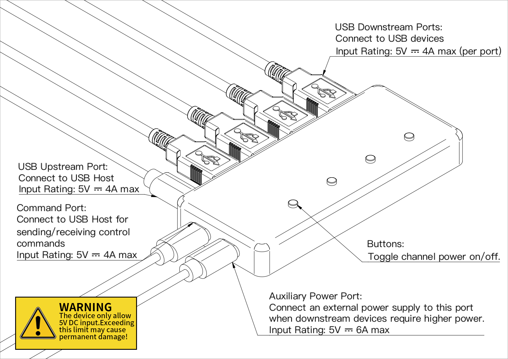

# Smart USB Hub Software User Guide

[简体中文](./README_cn.md)

## Introduction

To help users get started quickly, the SmartUSBHub Pro comes with out‑of‑the‑box control software that runs on Windows, macOS and Linux. This document introduces the two companion applications—`Control Panel` and `Oscilloscope`—and explains their features and operation.

> Before launching the software, make sure the device’s **USB upstream port** and **communication interface** are correctly connected to your host computer, as shown below.

## Control Pannel

`Control Panel` provides a clean and intuitive interface. You can toggle the power of each channel simply by clicking the corresponding switch.

### Control page

Once a hub is detected, the software automatically enters the **control page**. In this view, click the buttons associated with each channel to turn that channel on or off.

### Settings page

Swipe to the right in the control interface to access the **settings page**.

#### Connection options

To disconnect the current hub, click the “Disconnect” button. If multiple hubs are connected, use the drop‑down list to select and connect to a different device.

#### Configuration options

- **Interlock mode:** When enabled, only one channel can be powered on at a time; turning on any channel automatically turns off the others.

| Channel 1 | Channel 2 | Channel 3 | Channel 4 |
| --------- | --------- | --------- | --------- |
| ✗         | ✗         | ✗         | ✗         |
| 〇        | ✗         | ✗         | ✗         |
| ✗         | 〇        | ✗         | ✗         |
| ✗         | ✗         | 〇        | ✗         |
| ✗         | ✗         | ✗         | 〇        |

〇 = channel on; ✗ = channel off.

- **Button control:** Selected by default. When checked, the physical buttons on the device can be used to switch channels. If unchecked, channels can only be controlled through the software.
- **Power‑off memory:** When enabled, the device restores the previous on/off state of each channel after a power loss.
- **Default on:** When enabled, all channels are powered on by default when the device is powered up.

### Device information page

Swipe to the left in the control interface to access the **Device information page**.

This interface displays hardware information about the hub and allows you to set the device address.

#### Device address

The device address is used to distinguish between multiple hubs in a multi‑hub setup. Assign different addresses to different hubs so you can identify and control them individually. Valid addresses range from 0x0000 to 0xFFFFF.

## Oscilloscope

`Oscilloscope` application targets more advanced use cases. In addition to switching channels on and off, it provides real‑time voltage and current monitoring on four channels.

### overview

#### Control

- Click the button for each channel to toggle the VBUS power for that channel.

#### Monitoring

- Each channel has independent voltage and current acquisition. Use the “Voltage” and “Current” checkboxes to select which parameters to monitor.

- Right‑click in the chart area to choose the display format or export captured data.

  