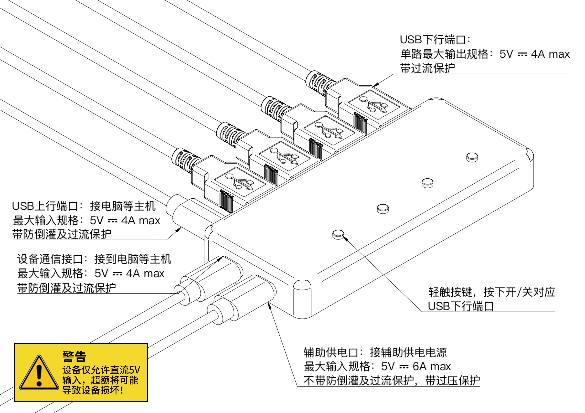

# 智能集线器配套软件说明

[English](./README.md)

## 简介

为了便于用户快速上手，SmartUSBHub Pro 提供了跨平台的配套控制软件，兼容 Windows、macOS 和 Linux 等主流操作系统。本指南对两款配套应用——`Control Panel 控制面板`和 `Oscilloscope 示波器`——的主要功能及操作方式进行说明。

> 在使用软件之前，请先将设备的 **USB 上行端口** 和 **通信接口** 正确连接至主机，如下图所示。
>

## Control Pannel 控制面板

`Control Panel` 提供了简洁直观的用户界面，通过点击对应的开关即可控制各通道电源的通断。

### 控制页面

当设备连接成功后，软件会自动识别并进入 **控制界面**。在该界面中，点击各通道对应的按钮即可打开或关闭通道电源。

### 设置页面

在控制界面向右滑动即可进入 **设置界面**。

#### 连接选项

如需断开当前集线器，可点击“断开”按钮。如果有多台集线器连接，在下拉列表中选择相应的设备即可建立新的连接。

#### 设置选项

- **互锁：**启用后，同一时刻仅允许一个通道处于通电状态，打开任意通道将自动关闭其他通道。

| 通道1 | 通道2 | 通道3 | 通道4 |
| ----- | ----- | ----- | ----- |
| ✗     | ✗     | ✗     | ✗     |
| 〇    | ✗     | ✗     | ✗     |
| ✗     | 〇    | ✗     | ✗     |
| ✗     | ✗     | 〇    | ✗     |
| ✗     | ✗     | ✗     | 〇    |

**符号说明：**〇：打开 		✗：关闭

- **按键控制：** 默认勾选该项，表示可以通过设备面板上的实体按键控制通道开关；取消勾选后，只能通过软件界面操作。
- **断电保存：**启用该选项后，设备在断电后重新上电将自动恢复上次通道的通断状态。
- **默认打开：**启用后，设备上电时所有通道将默认处于开启状态。

### 设备信息页面

在控制界面向左滑动即可进入 **设置界面**。

该界面用于显示集线器的硬件信息，并提供设备地址设置功能。

#### 设备地址

设备地址用于在多台集线器同时使用时进行区分，通过设置不同地址，用户可以按地址识别和控制特定设备。地址的取值范围为 0x0000 – 0xFFFFF。

## Oscilloscope 示波器

`Oscilloscope` 应用面向专业场景，除了具备每个通道的电源控制功能外，还提供四通道的电压和电流实时监测。

### 界面说明

#### 控制：

- 点击对应通道的按钮即可控制通道的VBUS通断。

#### 监测：

- 每个通道都配备独立的电压和电流采集功能。通过勾选“电压”或“电流”复选框，可以选择需要监测的参数。

- 在图表区域点击鼠标右键可以选择不同的图表显示方式，并可导出采集的数据。

  